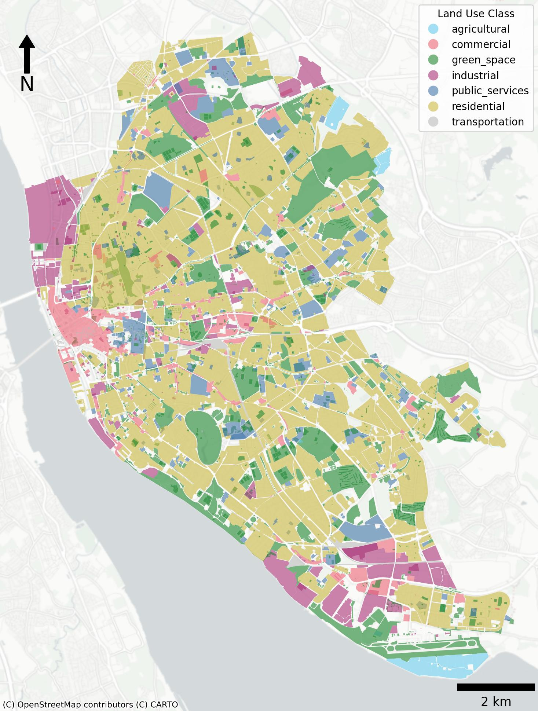
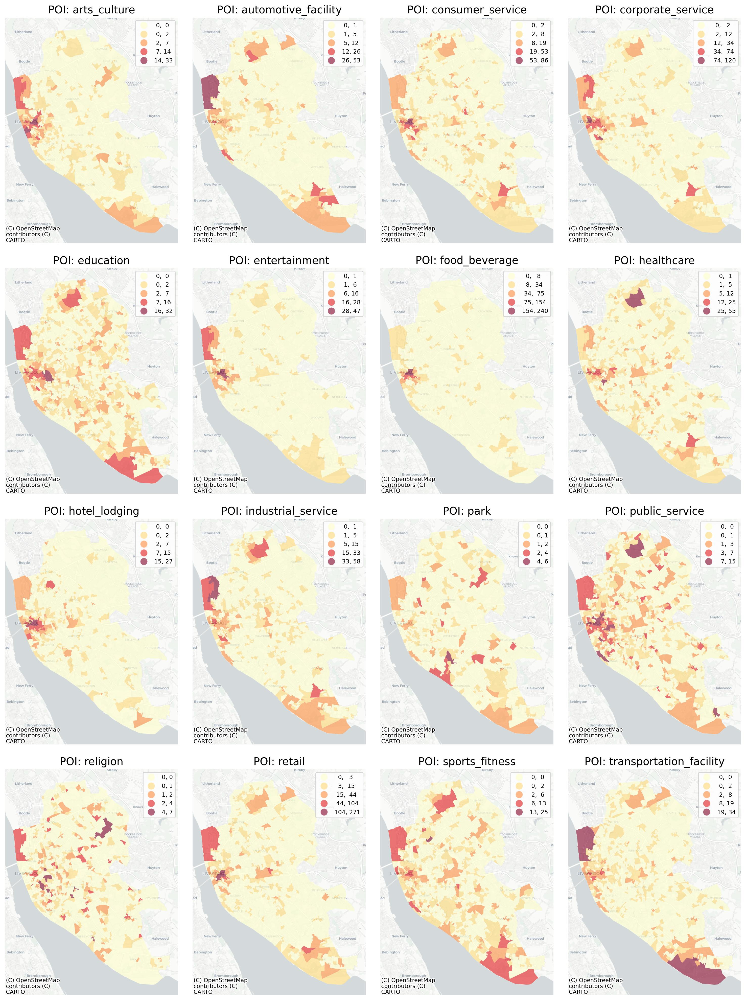
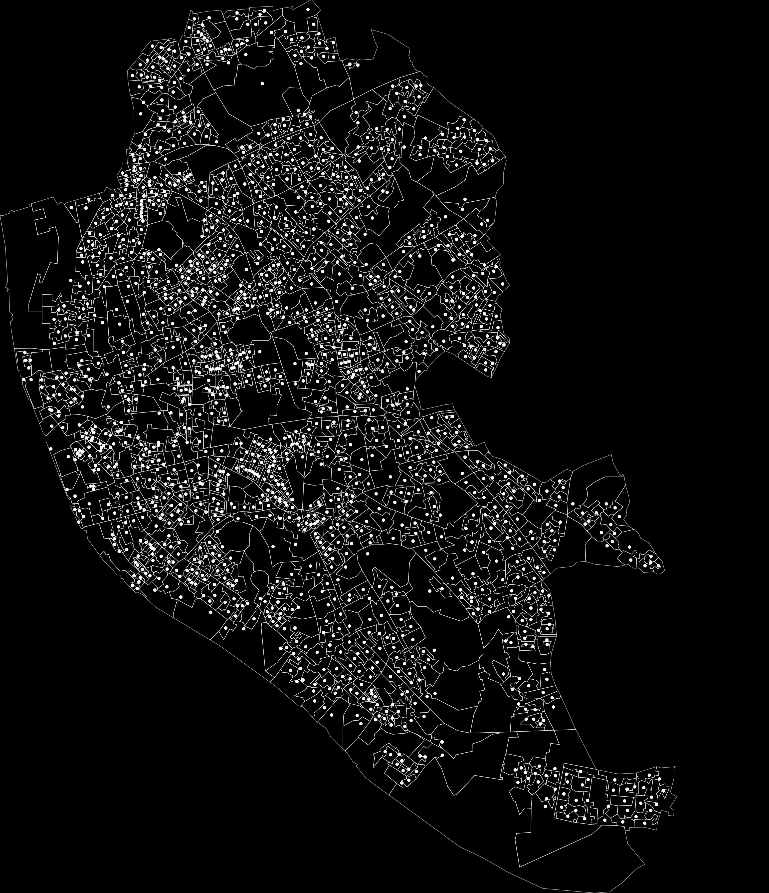
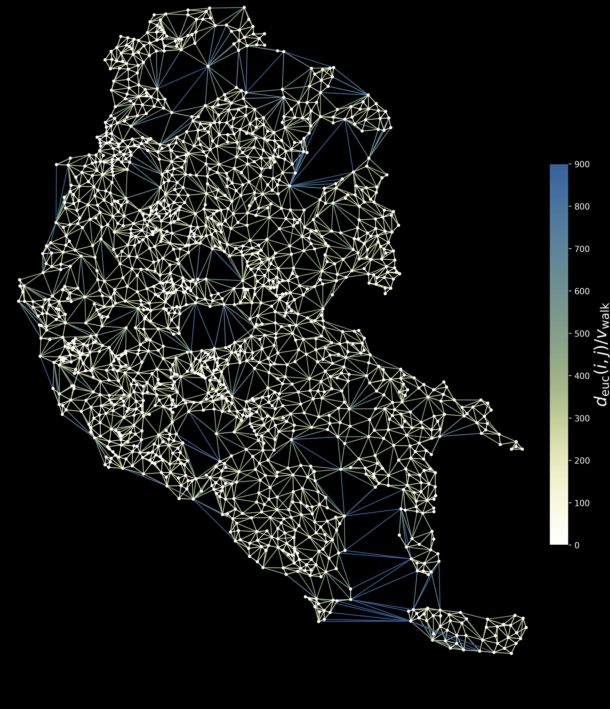
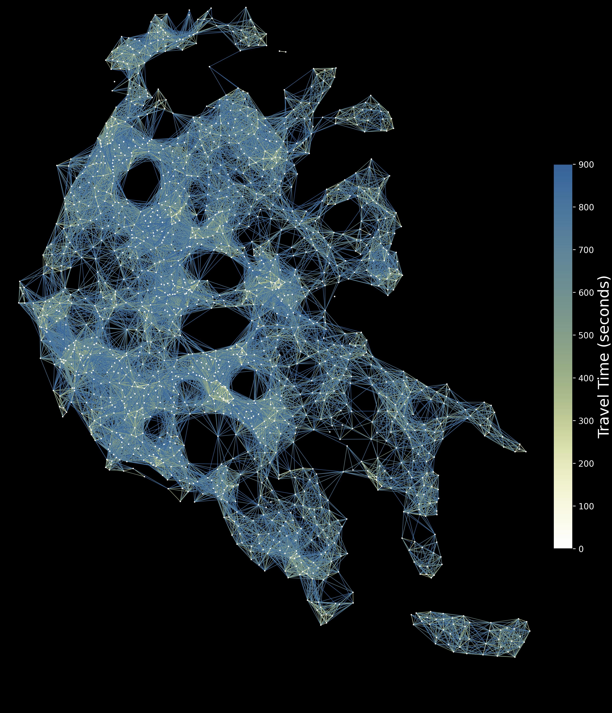
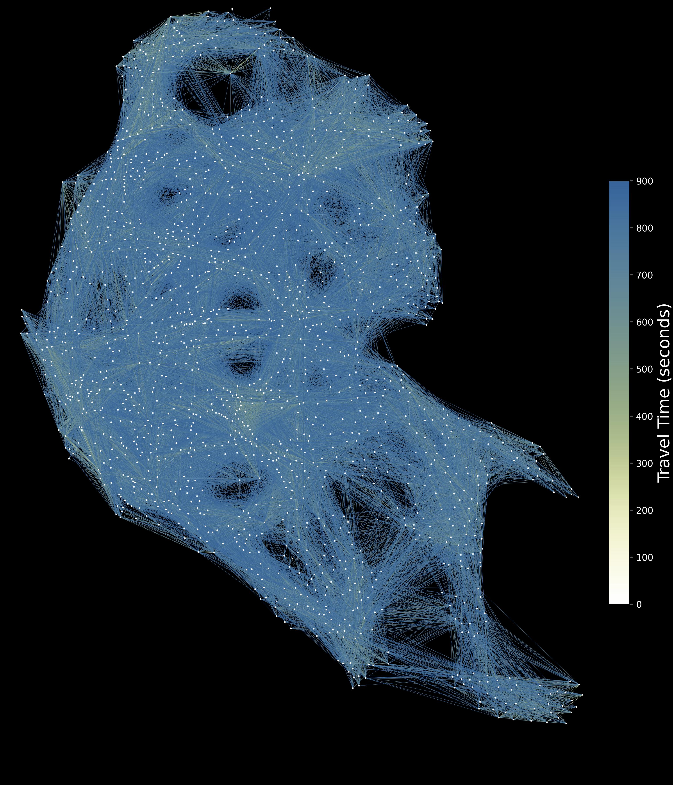
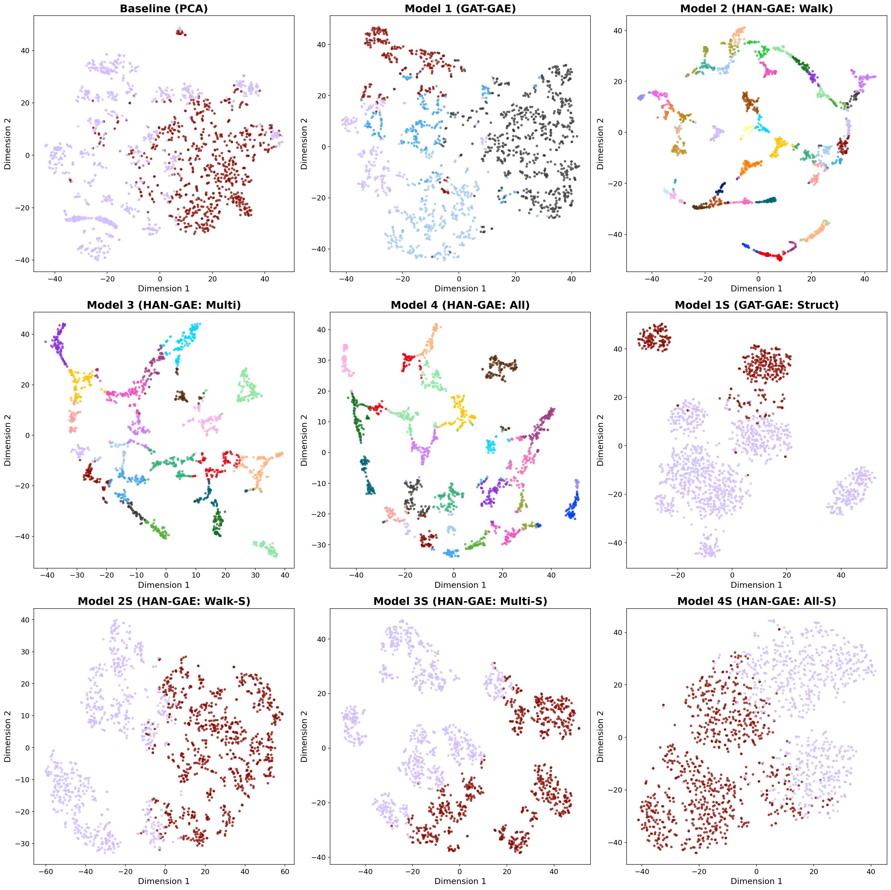
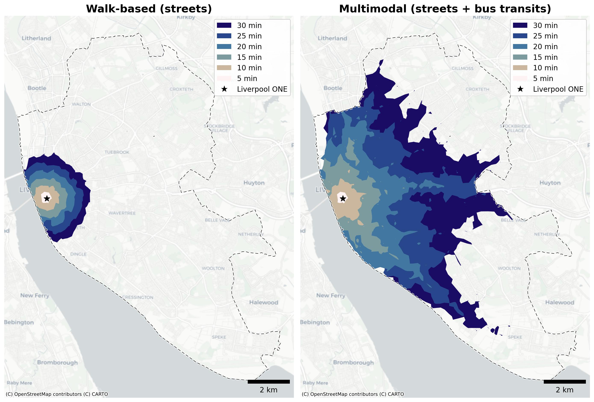

# Case Study for City2Graph
Liverpool case study for [City2Graph](https://github.com/c2g-dev/city2graph).

<p align="center">
  
</p>

<p align="center">
  
</p>

## Repository structure


```
city2graph-case-study
├── configs
│   └── experiment_config.yaml
├── data
│   ├── outputs
│   │   ├── checkpoints
│   │   ├── clusters
│   │   ├── embeddings
│   │   ├── figures
│   │   └── tables
│   ├── processed
│   │   ├── features
│   │   ├── graphs
│   │   └── isochrones
│   └── raw
│       ├── gtfs
│       ├── output_area
│       └── overture
├── notebooks
│   ├── 01_data_processing.ipynb
│   ├── 02_graph_construction.ipynb
│   ├── 03_model_training.ipynb
│   ├── 04_evaluation.ipynb
│   ├── 05_visualization.ipynb
│   └── appendix_evaluation_hdbscan.ipynb
├── notebooks_samples
│   ├── data
│   ├── morphology.ipynb
│   ├── morphology_combined.jpg
│   ├── morphology_graph.jpg
│   ├── morphology_steps.jpg
│   └── transportation_mobility.ipynb
├── src
│   ├── baselines
│   │   ├── __init__.py
│   │   └── kmeans.py
│   └── models
│       ├── __init__.py
│       ├── gat_gae.py
│       ├── han_gae.py
│       └── utils.py
├── pyproject.toml
├── uv.lock
├── .gitignore
├── .python-version
└── README.md
```

## Data (Zenodo)
The full data directory is hosted on Zenodo:

Sato, Y. (2026). Case Study Data for City2Graph: Clustering Urban Functions in Liverpool [Data set]. Zenodo. https://doi.org/10.5281/zenodo.18396285

Download the Zenodo archive and unzip it to the repository root so the `data/` directory matches the expected structure.

## Models and baselines
- `GATGAE`: 2-layer GAT encoder with DistMult structure decoder for the homogeneous contiguity graph.
- `HANGAE`: 2-layer HAN encoder with semantic attention across metapaths, DistMult per relation.
- `run_kmeans`: K-Means clustering for embeddings and baseline feature clustering.

## Quickstart (notebooks)

0. Prepare for the data in [data/](data)
1. Run [notebooks/01_data_processing.ipynb](notebooks/01_data_processing.ipynb)

<p align="center">
  
  
</p>


2. Run [notebooks/02_graph_construction.ipynb](notebooks/02_graph_construction.ipynb) / [notebooks/05_visualization.ipynb](https://github.com/c2g-dev/city2graph-case-study/blob/main/notebooks/05_visualization.ipynb)

<p align="center">
  
  
</p>
<p align="center">
  
  
</p>


3. Run [notebooks/03_model_training.ipynb](notebooks/03_model_training.ipynb)

<p align="center">
  
</p>

4. Run [notebooks/04_evaluation.ipynb](notebooks/04_evaluation.ipynb)

<p align="center">
  
</p>
<p align="center">
  
</p>

<p align="center">
  
</p>

## Outputs
Results (embeddings, clusters, tables, and figures) are written under data/outputs/.

## Reproducibility note
This case study uses uv for dependency management and environment reproducibility.

- Dependency specification: `pyproject.toml`
- Resolved, reproducible lockfile: `uv.lock`
- Python version pin: `.python-version` (3.12.8)

To reproduce the exact environment from this repository:

```bash
uv sync
```

To verify installed package versions in the uv environment:

```bash
uv run python - <<'PY'
from importlib.metadata import version

packages = [
  "city2graph",
  "contextily",
  "geopandas",
  "hdbscan",
  "ipykernel",
  "jupyter",
  "mapclassify",
  "matplotlib",
  "matplotlib-scalebar",
  "networkx",
  "numpy",
  "pandas",
  "PyYAML",
  "scikit-learn",
  "seaborn",
  "splot",
  "torch",
  "torch-geometric",
  "torchaudio",
  "torchvision",
]

for pkg in packages:
  print(f"{pkg}=={version(pkg)}")
PY
```

This case study was run on a CPU of Apple M2 (ARM) with 16 GB RAM, and CUDA was not used.

## Data sources and copyright

| Source | Data used | License / attribution | Source URL(s) |
| --- | --- | --- | --- |
| Office for National Statistics (ONS) | Output Areas (Dec 2021) EW BGC V2 boundaries; Output Areas (Dec 2021) population-weighted centroids V3 |   Open Government Licence v3.0; Contains OS data © Crown copyright and database right 2023 (boundaries). © Crown copyright and database right 2024 (centroids). See https://www.ons.gov.uk/methodology/geography/licences. | https://geoportal.statistics.gov.uk/datasets/6beafcfd9b9c4c9993a06b6b199d7e6d_0; https://geoportal.statistics.gov.uk/datasets/ons::output-areas-december-2021-ew-population-weighted-centroids-v3 |
| Overture Maps Foundation | Places (POIs), Base (land_use), Transportation (segment + connector), release 2025-12-17.0 | © OpenStreetMap contributors, Overture Maps Foundation. Accessed on Janurary 28th, 2026. See https://docs.overturemaps.org/attribution/. | https://overturemaps.org|
| UK Department for Transport (DfT) | Bus Open Data (GTFS timetables), North West feed (accessed Dec 10, 2025) | Open Government Licence v3.0; © Crown copyright. See https://www.nationalarchives.gov.uk/doc/open-government-licence/version/3/. | https://findtransportdata.dft.gov.uk/dataset/bus-open-data---download-all-timetable-data--18335fb19c4 |
| Metropolitan Transportation Authority (MTA) | GTFS schedules for NYC Subway (used in notebook samples) | Use is subject to MTA data feed terms and conditions. See https://www.mta.info/developers/terms-and-conditions | https://www.mta.info/developers|
| NY Open Data | MTA Subway Origin–Destination Ridership Estimate: Beginning 2025 (used in notebook samples) | Attribution in dataset metadata: “Metropolitan Transportation Authority”, with attribution link https://www.mta.info/open-data. | https://data.ny.gov/Transportation/MTA-Subway-Origin-Destination-Ridership-Estimate-B/y2qv-fytt |

## License
- **Code** (this repository: source, notebooks, configuration files): BSD 3-Clause License. See [LICENSE](LICENSE).
- **Data** (the Zenodo archive of inputs and derived artifacts): CC BY 4.0.

The third-party input data redistributed in the Zenodo archive remains under the licenses and attribution terms listed in [Data sources and copyright](#data-sources-and-copyright).

## Citation
If you use this case study, please cite both the paper and the dataset:

```bibtex
@misc{sato2026city2graph_casestudy_data,
  author       = {Sato, Yuta},
  title        = {Case Study Data for City2Graph: Clustering Urban Functions in Liverpool},
  year         = {2026},
  publisher    = {Zenodo},
  doi          = {10.5281/zenodo.18396285},
  url          = {https://doi.org/10.5281/zenodo.18396285}
}
```
